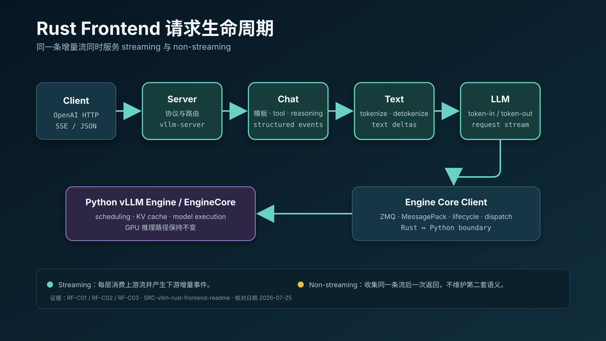
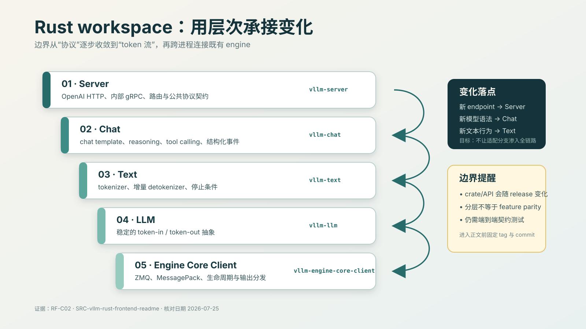
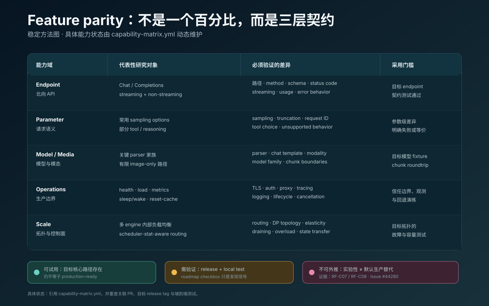

# vLLM Rust Frontend

> 架构边界、能力契约与生产采用

Owner: performance research / book editorial
Purpose: 为专项阅读、架构研讨和生产采用评审提供共同的问题、术语、证据和行动框架
Status: needs-refresh
Applies to: vLLM Rust Frontend；动态状态核对至 2026-07-25
Evidence grade: A/B 为主体；C 级演讲只补充背景；D 级转写只保留为线索
Verified date: 2026-08-15
Assumptions: 本仓库尚未复现 benchmark，也未完成目标 release 的 capability test
Open questions: 目标 release、真实资源成本、GPU-bound 收益与生产回退语义
Handoff: 第 3、6、9、13、14、15 章

## 如何使用这本小册子

这不是 vLLM Rust Frontend 的安装教程，也不是 Issue #44280 的中文抄录。它围绕一组共同问题组织不同来源，使 RFC、源码说明、roadmap、演讲和实验计划能够相互校正。

三种推荐读法：

- **30 分钟决策阅读：** 阅读“执行摘要”“能力契约”“生产采用门”和“结论分层”。
- **60～90 分钟专项研讨：** 配合 [`seminar-guide.md`](seminar-guide.md)，会前先读第 1、3、6、8 节。
- **研究与写作：** 从 claim ID 回到 `claims.yml` 和来源卡，再把稳定结论交接给对应章节。

任何动态结论都要通过 [`../../tracking/`](../../tracking/) 重新核对。

---

## 1. 执行摘要

Rust Frontend 的核心价值不是“把 vLLM 改写成 Rust”，而是替换 OpenAI-compatible serving 的北向 CPU 路径，同时保持现有 Python engine/core 和 GPU 模型执行边界。[RF-C01]

这个边界带来三个重要结果：

1. 可以在不重写 scheduler、KV Cache 和模型执行的前提下，独立优化请求解析、tokenization、structured parsing 和流式响应。
2. Rust 与 Python Frontend 可以在相同 engine 边界下比较，但只有 workload 确实 frontend-bound 时，性能差异才可能成为端到端收益。[RF-C06]
3. “能够启动”和“可以替代 Python Frontend”之间仍隔着 endpoint、parameter/model、operations 三层能力契约。[RF-C08]

截至 2026-07-25，官方 roadmap 仍将 Rust Frontend 标为 experimental、not feature-complete。[RF-C07] Issue 中越来越多 checkbox 被勾选，说明项目正在快速推进；checkbox 只代表 roadmap 状态，不证明能力已经进入某个 release，更不证明它适用于本书的模型和部署条件。

本专题当前最重要的下一步不是继续收集介绍性材料，而是：

- 固定目标 release tag 与 commit；
- 建立 Python/Rust capability contract；
- 复现 frontend-bound benchmark，并增加 GPU-bound 对照；
- 演练 canary、drain、cancel 和 fallback。

---

## 2. 共同研究问题

### Q1：它究竟替换了什么？

Rust Frontend 替换 HTTP/API、Chat Template、tokenization、structured parsing 和响应流等 serving frontend 职责；它通过既有 engine/core 边界连接 Python engine，而不是重写 GPU 推理引擎。[RF-C01]

### Q2：为什么要替换这一层？

当模型较小、并发很高、输入预处理重或输出流分发密集时，Python API server 可能先于 GPU 成为瓶颈。此时增加 frontend 进程会带来额外 CPU、内存、路由和运维成本。Rust 方案试图提高单 frontend 的上限，并用分层设计降低长期复杂度。

这仍是条件命题：如果 GPU 已经饱和，frontend 更快不一定改变端到端吞吐。

### Q3：架构上的关键变化是什么？

官方 workspace 通过 Server、Chat、Text、LLM 和 Engine Core Client 分离协议、对话语义、文本/token 转换与后端通信。[RF-C02] Streaming 被视为主路径，非流式响应通过收集同一流构造，从设计上减少两套逻辑漂移。[RF-C03]

### Q4：功能对齐应该怎样衡量？

不能使用一个成功的 `/v1/chat/completions` 响应代表“OpenAI-compatible”。必须分别验证 endpoint、parameter/model 和 operations。[RF-C08]

### Q5：现有 benchmark 证明了什么？

它证明在特定 frontend-bound 条件下，Rust Frontend 可以提高 frontend ceiling；它不证明任意模型、硬件和并发下都具有相同收益。[RF-C06]

### Q6：什么时候可以生产采用？

只有目标 workload 的契约、性能、观测、生命周期与回退均通过，并固定到具体 release/commit，才可以从“实验性路径”升级为“受限生产可用”。

---

## 3. 最小概念系统

本专题使用 9 个 nouns 建立共同语言：

| Noun          | 它回答的问题                                              |
| ------------- | --------------------------------------------------- |
| Request       | Frontend 接受、规范化或拒绝什么？                               |
| Frontend      | 北向 serving 层承担哪些责任？                                 |
| Protocol      | HTTP/SSE、OpenAI API 与内部协议如何转换？                      |
| Chat          | messages、template、reasoning 和 tool call 如何形成语义？     |
| Token         | Frontend 与 Engine 之间交换的核心数据是什么？                     |
| Stream        | token、text delta、structured event 和 SSE chunk 如何演化？ |
| Engine Client | 请求如何跨越 Rust/Python 边界？                              |
| Router        | 请求如何选择 Engine 或 DP rank？                            |
| Capability    | 什么条件下可以宣称 Rust/Python 行为等价？                         |

12 个 verbs 描述最小处理语法：

```text
accept → validate → render → tokenize
       → route → submit → generate
       → detokenize → parse → stream
```

生产控制旁路：

```text
observe → detect → drain / abort → fallback
```

详细定义见 [`../../vocabulary.md`](../../vocabulary.md)。

---

## 4. 架构边界：为什么不是重写 Engine



一次请求可以被理解为四次语义收敛：

1. 外部 JSON 收敛为经过校验的 Request；
2. messages 和参数收敛为 prompt/text；
3. text 收敛为 engine 可消费的 token 请求；
4. engine token outputs 再展开为 text delta、tool/reasoning event 和 SSE response。

这个分界控制了验证半径。如果同时重写 scheduler、KV cache、distributed execution 和 model runner，就无法区分性能或正确性变化来自 frontend 还是 engine。保留 engine boundary，使对比和回退更容易设计。\[RF-C01]

### 分层不是目录美学



分层真正要保护的是以下不变量：

- Protocol 不应直接依赖某个模型 parser 的临时行为；
- Chat layer 不应承担 engine scheduling；
- Text layer 应明确区分 tokenize、incremental detokenize 和 truncation；
- Engine Client 应负责提交、多路复用、中止和边界错误；
- streaming/non-streaming 应尽量共享语义来源。\[RF-C02]\[RF-C03]

进入正文前，这些概念必须映射到固定 release tag 的实际 crate、类型、函数和测试。

---

## 5. Stream-native 与 parser 正确性

Rust Frontend 不应只把 Python 代码逐行翻译成 Rust。Roadmap 明确指出 tool/reasoning parser 采用重新设计的架构，新增 parser 应适配该设计。\[RF-C04]

### 三种流不能混为一谈

```text
Engine token stream
  → decoded text stream
  → reasoning/tool event stream
  → SSE response stream
```

tool marker、JSON 字段或 reasoning delimiter 可能跨越任意 token/chunk 边界。一个 parser 即使能解析完整字符串，也不等于能正确处理增量流。

### 最小正确性要求

- 同一输出按不同 token/字符边界切分，最终结构保持一致；
- 未决 marker 前缀不能提前泄露为普通文本；
- streaming 与 non-streaming 的 text、tool calls、usage 和 finish reason 等价；
- cancel、disconnect 和 parser error 能终止后端工作；
- 不支持的参数明确失败，不静默忽略。

这些要求比“接口返回 200”更接近真实兼容性。

---

## 6. Capability contract：从二元判断转向三层契约



### 第一层：Endpoint contract

验证目标 endpoint 是否存在，以及：

- method、path 与 content type；
- 状态码和错误 schema；
- streaming/non-streaming；
- usage 与 finish reason；
- shutdown 和 overload 时的响应。

### 第二层：Parameter/model contract

验证目标模型实际使用的：

- sampling 和 truncation 参数；
- chat template；
- tool/reasoning parser；
- structured output；
- LoRA 和 multimodal 输入；
- unsupported parameter 的失败行为。

### 第三层：Operations contract

验证：

- TLS/auth 或上游 gateway 信任边界；
- CORS、root path 和代理行为；
- request ID、metrics、logs 和 tracing；
- health、load、sleep/wake 和 cache 操作；
- timeout、cancel、drain、shutdown 和 fallback。

三层都通过，才能对一个明确的 `model + endpoint + parameter profile + deployment topology` 使用“可替代”。代表性动态状态见 [`capability-matrix.yml`](capability-matrix.yml)。

---

## 7. 怎样阅读性能证据

RFC benchmark 的共同条件包括：

```text
vLLM 0.19.0
Qwen3-0.6B
DP = 4
4 × GB200
concurrency = 1024
request rate = inf
```

在 decode 场景中，Rust Frontend 为 559.79 req/s，默认 Python Frontend 为 509.56 req/s；P50 TTFT 分别为 50.51 ms 和 165.95 ms。

在长输入 preprocess-hot 场景中，Rust 为 837.00 req/s，默认 Python 为 162.23 req/s；Python frontend 扩至 asc=32 后达到 785.98 req/s。

这些观察支持 RF-C06，但必须连同边界一起引用：

- 小模型和极高并发更容易暴露 frontend ceiling；
- `request_rate=inf` 是压力上限，不是典型线上到达过程；
- 未提供本仓库复现；
- 没有完整 CPU、RSS、错误率和 GPU-bound 对照；
- 不能外推到更大模型、低并发或不同硬件。

### 正确的复现实验

| 实验                | 目的                  | 必须记录                             |
| ----------------- | ------------------- | -------------------------------- |
| Frontend-bound    | 验证 frontend ceiling | CPU、RSS、req/s、TTFT、ITL、错误率、进程数   |
| GPU-bound         | 验证真实端到端收益边界         | GPU 利用率、吞吐、TTFT、ITL、frontend CPU |
| Parser stress     | 验证增量正确性             | chunk 边界、错误输入、结构等价               |
| Disconnect/cancel | 验证资源释放              | in-flight、engine abort、连接与内存残留   |

---

## 8. 生产采用门

### Gate 0：固定对象

- release tag、commit、镜像 digest；
- 模型、tokenizer、精度和硬件；
- endpoint/parameter allowlist；
- Python Frontend 基线。

### Gate 1：离线契约

- endpoint/parameter/model fixtures 通过；
- unsupported behavior 明确失败；
- streaming/non-streaming 和 parser invariants 通过。

### Gate 2：影子验证

- 相同输入比较结构化语义，而不只比较文本；
- request ID、metrics、logs 和 traces 可以关联；
- 不让影子请求影响生产 engine 容量。

### Gate 3：受限 canary

- 从 `model + endpoint + parameter profile` 的 1% 流量开始；
- 监控契约错误、P99 TTFT、parser mismatch、CPU/RSS 和取消泄漏；
- 只扩大已经通过契约的能力集合。

### Gate 4：drain 与 fallback

触发阈值后：

```text
停止接收 → drain in-flight → abort 超时请求
        → 切回 Python Frontend → 保存失败 fixture/trace
```

`VLLM_USE_RUST_FRONTEND=1` 提供选择面，但环境变量本身不是完整回退方案。\[RF-C05]

---

## 9. 跨来源命题

| Claim | 综合命题 | 主要证据关系 | 当前边界 |
|---|---|---|---|
| RF-C01 | Rust Frontend 替换北向 serving 层，不重写 Python engine | RFC 与 roadmap 相互确认边界 | 目标 release 的协议与取消语义待核对 |
| RF-C02 | workspace 分层隔离协议、Chat、Text、token 流和 Engine Client | 官方 README 给出结构 | 浮动 `main`，尚未固定 tag/commit |
| RF-C03 | streaming 是主路径，non-streaming 收集同一输出流 | README 为主，演讲只补充设计解释 | 等价性和 chunk-boundary 测试未完成 |
| RF-C04 | parser 面向增量流重新设计，不应逐行移植 Python | roadmap 与 README 交叉确认 | 目标模型 parser/fixture 覆盖待验证 |
| RF-C05 | Python launcher 可以监管并选择 Rust 路径 | RFC 与 roadmap 共同支撑 | 编排环境中的 drain/fallback 未演练 |
| RF-C06 | 特定 frontend-bound 压测中 Rust 提高 frontend ceiling | RFC 原始 benchmark | 未本地复现，不能外推 GPU-bound |
| RF-C07 | 当前仍为 experimental、not feature-complete | 动态 roadmap 与 README | 每次引用前必须刷新 |
| RF-C08 | 生产采用需要 endpoint/parameter/operations 三层契约 | 由 roadmap 缺口与 RFC 边界推导 | 本书工程判断，尚未形成完整测试套件 |
| RF-C09 | Rust 模块可能复用于 gateway/control plane | 仅 D 级转写方向性线索 | 只能保留为未来假设 |

这个矩阵是小册子主体的综合结果；具体原文、适用范围、反例和 verification gap 以 [`../../claims.yml`](../../claims.yml) 为准。

---

## 10. 来源如何相互校正

| 来源              | 最适合回答                       | 主要盲点                      |
| --------------- | --------------------------- | ------------------------- |
| RFC #40846      | 为什么做、原始设计和 benchmark        | 后续 release 状态             |
| Integration PR  | 代码如何进入主仓                    | 当前能力是否完整                  |
| `rust/` README  | workspace 与使用边界             | 浮动 `main` 不是永久版本事实        |
| Issue #44280    | 当前 roadmap、设计取舍和缺口          | checkbox 不证明 release/test |
| 演讲 PDF          | 设计动机和解释性图景                  | C 级材料、许可和复现限制             |
| Version Monitor | 新 release 与 release note 线索 | 不验证 endpoint 行为           |
| 本仓库实验           | 目标 workload 的实际结果           | 不能自动外推其他部署                |

主题阅读的目标不是选出“最权威的一篇”，而是为每个问题选择最适合的证据，并显式记录它不支持什么。

---

## 11. 分歧、张力与未决问题

### Feature parity 与产品取舍

Roadmap 不追求机械的 Python 1:1 移植，而强调生产价值和 Rust 架构目标。这意味着“缺少 Python 参数”可能是未完成，也可能是主动重新设计。书稿必须分别记录兼容性事实与设计判断。

### Roadmap 进展与 release 事实

Issue 当前已有多项安全、LoRA、DP 和生命周期能力被勾选，但仍需找到关联 PR、merge commit、首个包含它的 release，并在目标 tag 上执行契约测试。

### Frontend ceiling 与端到端价值

RFC 证明特定压力测试中的 frontend ceiling，不回答大模型 GPU-bound 服务能节省多少成本。这个问题只能由成对实验回答。

### Rust 安全性与服务可靠性

类型和所有权可以减少部分内存与并发错误，但不会自动提供正确的 auth、TLS、proxy、tracing、overload、drain 或回退语义。

### 未来 gateway/control-plane 复用

演讲转写提出 Rust 模块未来可能用于 gateway/router/control plane。\[RF-C09] 这只能作为研究假设，不能写成已发布方向或上游承诺。

---

## 12. 研究议程

### P0：版本与能力

- [ ] 选择目标 vLLM release 和 exact commit。
- [ ] 从目标 tag 自动枚举 Python/Rust endpoint 和参数。
- [ ] 将代表性矩阵扩展为可执行 capability suite。
- [ ] 为每个 roadmap `checked` 项记录 PR、merge commit 和首个 release。

### P0：正确性与回退

- [ ] 建立 streaming/non-streaming 等价 fixture。
- [ ] 建立 parser 任意 chunk-boundary/property test。
- [ ] 验证 disconnect、cancel、shutdown、drain 和 overload。
- [ ] 演练 Rust → Python fallback。

### P1：性能与容量

- [ ] 复现一组 RFC frontend-bound workload。
- [ ] 增加大模型 GPU-bound 对照。
- [ ] 对比 CPU、RSS、进程数、TTFT、ITL、吞吐和错误率。
- [ ] 建立 frontend capacity saturation 指标。

### P1：生产边界

- [ ] 验证 TLS/auth/CORS/root path 的目标 release 行为。
- [ ] 对齐 metrics、logging、tracing 和 request ID。
- [ ] 验证 LoRA、多模态和目标 parser allowlist。

---

## 13. 结论分层

### 已有 A/B 级证据支持

- Rust Frontend 替换北向 serving frontend，而不是 Python engine。\[RF-C01]
- workspace 使用分层边界组织协议、Chat、Text、LLM 和 Engine Client。\[RF-C02]
- streaming 是主要设计路径，parser 面向增量流重新设计。\[RF-C03]\[RF-C04]
- 可以通过 Python launcher 和环境变量选择该路径。\[RF-C05]
- 特定 frontend-bound benchmark 中存在明显收益。\[RF-C06]
- 当前仍是 experimental、not feature-complete。\[RF-C07]

### 本书工程判断

- 生产采用应使用 endpoint/parameter/operations 三级 capability contract。\[RF-C08]
- rollout 和 fallback 单位应小于整个集群。
- benchmark 必须同时包含 frontend-bound 和 GPU-bound。

### 待验证

- 目标 release 中每项 roadmap 能力的真实可用性；
- CPU、RSS 与总拥有成本；
- 大模型 GPU-bound 部署的实际收益；
- metrics、tracing、cancel 和 drain 的等价性。

### 不得写成事实

- Rust Frontend 已与 Python Frontend 无条件等价；
- roadmap checkbox 等于稳定 release 支持；
- 任意部署都能获得 RFC 中的收益；
- Rust 模块已经成为 gateway/control plane。

---

## 14. 动态附录

本节只给出基线入口，不复制完整 roadmap。

- 当前基线：[`../../tracking/upstream-snapshot.json`](../../tracking/upstream-snapshot.json)
- 变化日志：[`../../tracking/change-log.md`](../../tracking/change-log.md)
- 代表性能力矩阵：[`capability-matrix.yml`](capability-matrix.yml)
- 自动检查：`python3 scripts/check_rust_frontend_tracking.py`

当前基线：

```text
Issue #44280: Open
Issue updated: 2026-07-24T11:34:59Z
Checklist: 40 checked / 61 unchecked
Latest vLLM release: v0.27.1
Version Monitor snapshot: stale (v0.25.1, cutoff 2026-07-18); release baseline: v0.27.1
```

这些数字只用于发现变化；引用任何具体能力前必须重新核对。

<!-- verified: v0.27.1, 2026-08-15 -->

下一步验证：在 v0.27.1 固定 tag 上核对 roadmap 已列能力的源码/测试，并用 OpenAI、Anthropic、TLS/auth、LoRA、multimodal 请求做参数级 parity smoke test。

---

## 15. 研讨结论模板

每次专项研讨最终只需要形成以下记录：

```text
Decision:
Target release/commit:
Target workload:
Accepted claims:
Rejected generalizations:
Required capability tests:
Required experiments:
Canary scope:
Rollback trigger:
Owner:
Review date:
```

没有 owner、版本和验证动作的“共识”，不进入 claim spine，也不进入正式书稿。
